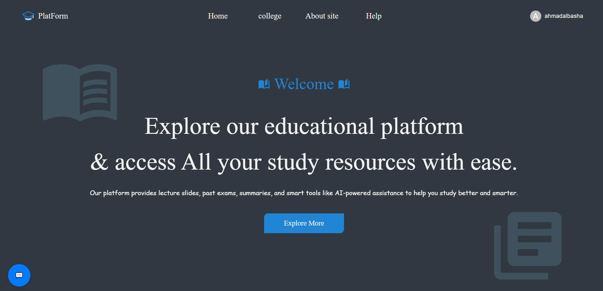
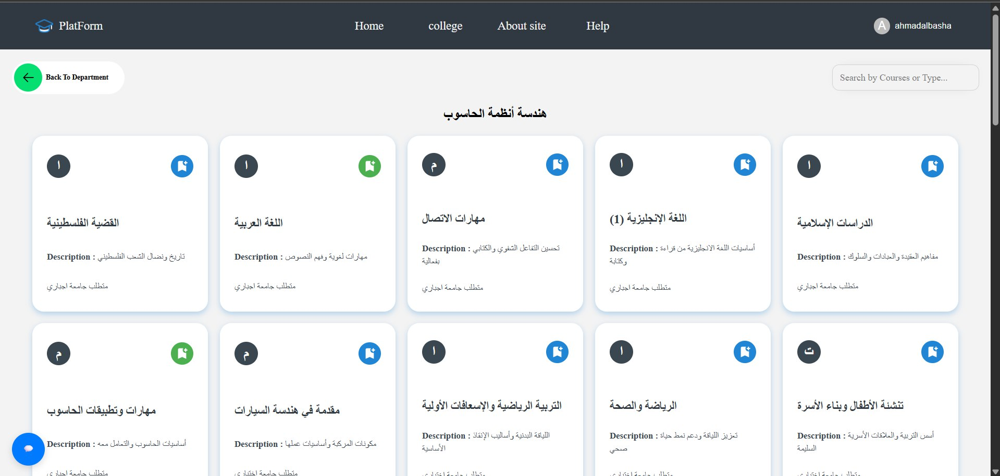
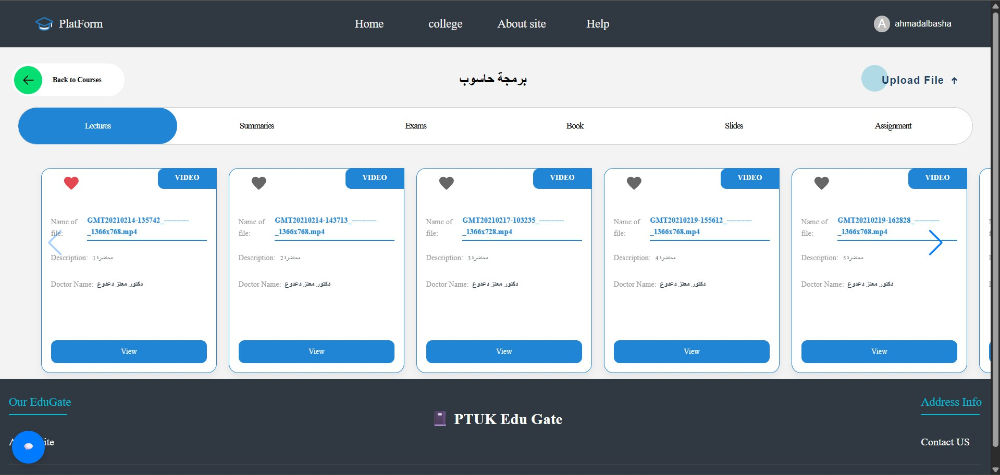
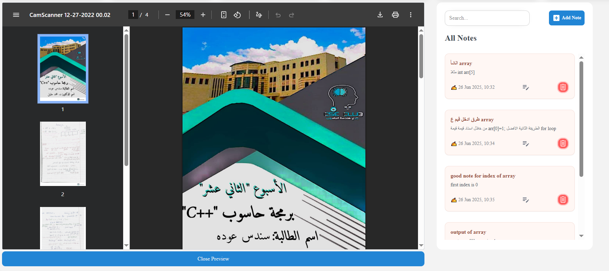
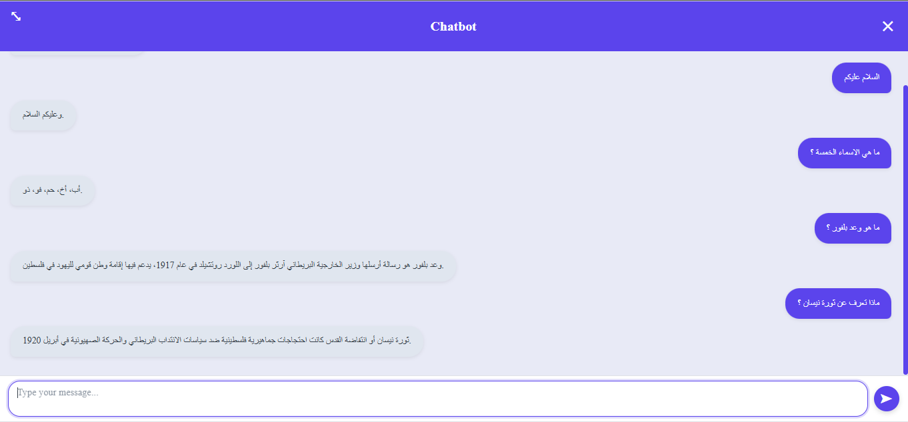
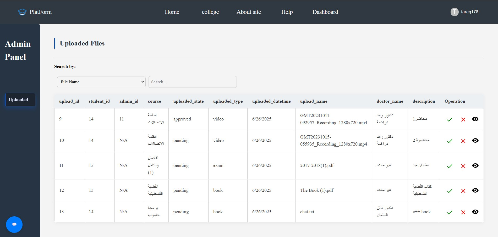
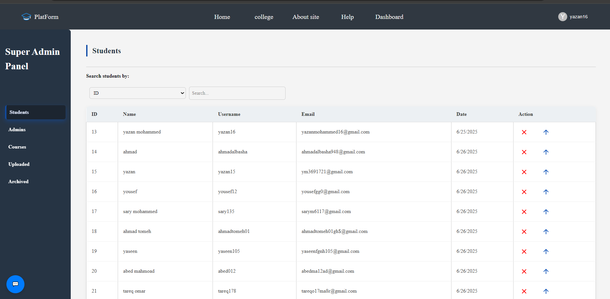

# 🎓 PTUK EduGate – Educational Platform

**A smart, centralized educational platform for Palestine Technical University – Kadoorie (PTUK) students.**  
The platform organizes academic resources and integrates an AI assistant to answer course-related questions in both Arabic and English.

---

## 📘 Overview

Students often struggle to find, organize, and access university study materials such as books, summaries, and past exams. EduGate solves this by providing:

- A centralized platform for academic materials
- Role-based access and content management
- An intelligent AI chatbot tailored to the local academic context

---

##  Features

- 🗂️ Browse & download categorized academic materials
- 🔐 Role-based access (Guest, Student, Admin, Super Admin)
- 📥 Upload files (notes, books, past exams)
- ❤️ Favorite files & courses
- 📝 Add notes directly inside the platform
- 🤖 AI chatbot for course-specific questions
- 📊 Admin dashboards for file approval & user management

---

## 🧠 AI-Powered Assistant

- **MiniLM** – Semantic search using sentence embeddings
- **LLaMA (via Groq API)** – Context-aware answer generation

**Supported Subjects:**

- Palestinian Cause  
- Islamic Studies  
- Arabic Language  
- English 1  
- Communication Skills

> The dataset includes 15,000+ Q&A pairs built from real academic content.

---

##  Tech Stack

### Frontend
- React.js  
- Tailwind CSS  
- HTML5, CSS3, JavaScript (ES6+)

### Backend
- Node.js  
- Express.js  
- MySQL  
- JWT authentication

### AI 
- Python  
- HuggingFace Transformers  
- MiniLM + LLaMA (via Groq API)  
- Cosine similarity  
- Pandas, Numpy, Sklearn, PyTorch

---

## 🖼️ Screenshots

###  Home Page
> When the website is first opened  

###  Courses & Materials Page
> After selecting the department. Courses can be saved to favorites  

###  Files Page (Selected Course)
> Shows all files under a course with options to add notes or mark as favorite  

###  File View + Notes
> Allows viewing a file and attaching notes to it  

###  AI Chatbot
> The built-in AI assistant answering course-specific questions  

###  Admin Dashboard
> Admin interface to manage files, students, and course materials  

### Super Admin Dashboard
> Full platform control over users, admins, departments, and content  

---

## 👥 User Roles

| Role            | Capabilities                                                    |
| --------------- | --------------------------------------------------------------- |
| **Guest**       | Browse and view courses/materials only                          |
| **Student**     | Upload files, add notes, save favorites                         |
| **Admin**       | All student features + approve/reject uploaded files            |
| **Super Admin** | Full control: manage users, admins, departments, and courses    |
